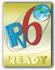

 {.float-right .mr-5}

### Core (Phase-2 Approvals)

The following formats may be used for the Core Logo approvals:

* [Original Logo Data (PhotoShop Ver.7 PSD Format)](https://www.ipv6ready.org/images/private/2/IPv6_ready_logo_phase2.psd)
* [JPEG Format Logo Data](https://www.ipv6ready.org/images/private/2/IPv6_ready_logo_phase2.jpg)
* [JPEG Format Logo Data (High Resolution)](https://www.ipv6ready.org/images/private/2/IPv6_ready_logo_phase2_hires.jpg)
* [PDF Format Logo Data](https://www.ipv6ready.org/images/private/2/IPv6_ready_logo_phase2.pdf)
* [Black and White Logo (15.5mm x 18.6mm, 600dpi)](https://www.ipv6ready.org/images/private/2/IPv6_ready_logo_mono_155_gold.jpg)
* [Black and White Logo (5.0mm x 6.0mm, 600dpi)](https://www.ipv6ready.org/images/private/2/IPv6_ready_logo_mono_50_gold.jpg)
* [Black and White Logo (7.7mm x 9.3mm, 600dpi)](https://www.ipv6ready.org/images/private/2/IPv6_ready_logo_mono_77_gold.jpg)
* [Black and White Logo (A4 JPG, 600dpi)](https://www.ipv6ready.org/images/private/2/IPv6_ready_logo_mono_a4_gold.jpg)
* [Black and White Logo (A4 PSD, 600dpi)](https://www.ipv6ready.org/images/private/2/IPv6_ready_logo_mono_a4_gold.psd)

### IPsec Approvals Only

* [IPsec Logo](https://www.ipv6ready.org/images/private/ipsec/IPsec.psd)

### DHCP Approvals Only

* [DHCP Logo](https://www.ipv6ready.org/images/private/dhcp/DHCP.psd)

### CE Router Approvals Only

* [CE Router Logo](https://www.ipv6ready.org/images/private/cerouter/cerouter.png)